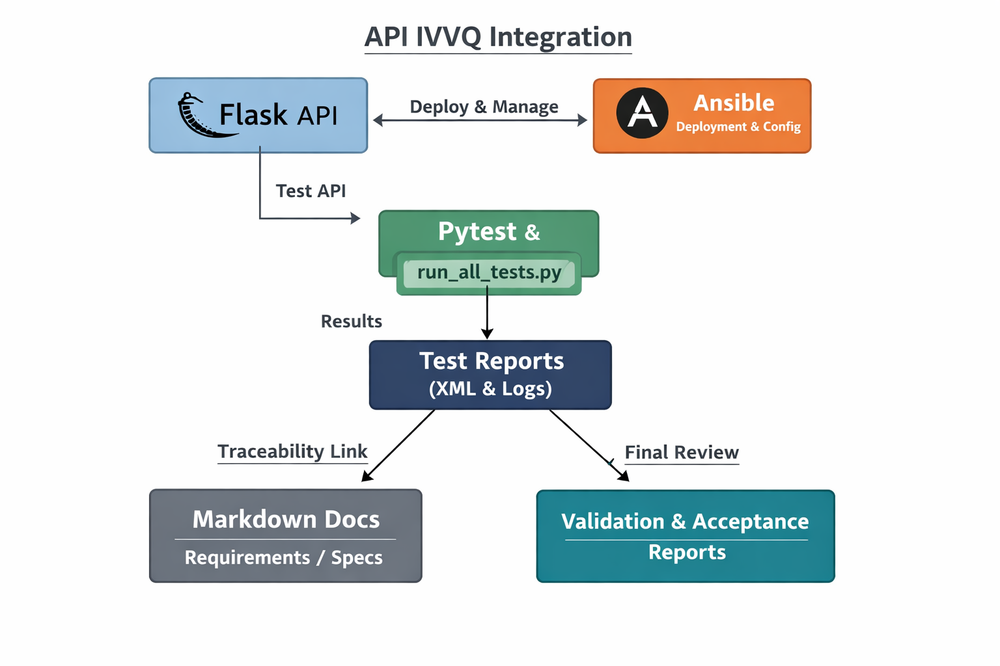

```markdown
# 📑 API IVVQ Demo Project

## Overview
This project demonstrates the application of the IVVQ (Integration, Verification, Validation, Qualification) cycle to a simple API.  
It includes requirements, specifications, traceability, automated tests, and final validation/acceptance reports.



*Figure 1 — Integration of Flask, Ansible, Pytest, Documentation, and Reports*

### Quick Flow Explanation
- **Ansible** deploys and configures the **Flask API** at `/api/hello`.  
- The API is tested by **Pytest** and `run_all_tests.py`.  
- Results are captured in **XML & Markdown reports**.  
- Reports feed into **Validation & Acceptance documents**, ensuring traceability back to **Business Requirements**.

---
## 📂 Folder Structure

project/
├── README.md             # Root project overview (shown on GitHub)
├── ansible/              # Deployment automation (playbook.yml)
├── api/                  # Demo API code (Flask app.py)
├── docs/                 # BRS, FS, Traceability Matrix, Validation Report, Acceptance Report, Test Plan, Test Execution
│   └── images/           # Diagrams (integration_diagram.png)
└── tests/                # test_api.py, run_all_tests.py
└── reports/          # results.xml, test_execution_detailed.md

## How to Run
1. **Start the API**  
   ```bash
   python api/app.py
   ```

2. **Run all tests**  
   ```bash
   python tests/run_all_tests.py
   ```

3. **View reports**  
   - Detailed execution: `tests/reports/test_execution_detailed.md`  
   - Pytest XML: `tests/reports/results.xml`  
   - Documentation: `docs/`

---

## Deliverables
- **Business Requirements (BRS)**  
- **Functional Specifications (FS)**  
- **Traceability Matrix**  
- **Test Execution Record**  
- **Validation Report**  
- **Acceptance Report**

---

## Demo Notes
- Shows a complete IVVQ cycle applied to an API.  
- Evidence is self‑contained in `docs/` and `tests/reports/`.  
- Demonstrates QA discipline, automation, and documentation skills.  

---

## Methodology
This API IVVQ demo project was completed with the assistance of AI Copilot, which generated much of the coding and draft documentation. The AI provided:  
- Test modules for API response validation, error handling, and deployment checks.  
- Draft documentation across requirements, specifications, and validation phases.  

My contribution focused on:  
- Integration of components — code, documentation, and results — into a cohesive demo project that demonstrates both technical reproducibility and business clarity.  
- Final structuring and document quality checks to ensure the project is presented in a professional and reliable manner.

---

## Key Takeaways
- **Automation Skills**: Built and executed automated test scripts with Python and Pytest.  
- **QA Discipline**: Applied full IVVQ cycle — requirements, specs, traceability, validation, acceptance.  
- **Documentation Quality**: Produced professional reports (BRS, FS, Validation, Acceptance) with clear traceability.  
- **Portfolio Readiness**: Project is self‑contained, reproducible, and suitable for employer demo.  
```
